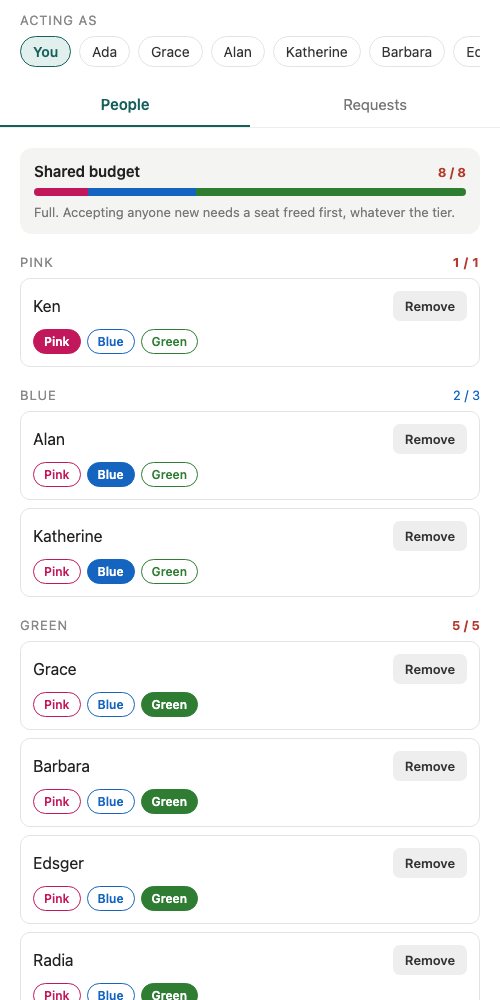

# The Capacity Problem

A small social app where the contact list has a hard ceiling: three tiers with
their own caps, one shared budget that binds first, and four rules underneath
that are the actual exercise. This is my submission.

- **Agent transcript:** [`transcripts/`](transcripts/) — the full session, see
  [Agent transcript](#agent-transcript) below.
- **Rules:** [`api/internal/capacity/capacity.go`](api/internal/capacity/capacity.go)
  — the only place a seat decision is made.
- **Rule 4 (the race):** [`api/internal/store/seats.go`](api/internal/store/seats.go)
  and the test in [`api/internal/store/race_test.go`](api/internal/store/race_test.go).

## Run it

Needs Go 1.25+, Node 20+, Docker.

```bash
make up        # mongo on :27117 (replica set, so transactions work)
make api       # graphql on :8080, seeds ten users on first boot
make mobile    # expo — press i for the iOS simulator, w for web
make check     # go build + vet + test, and tsc on the client
make smoke     # walks every mutation against the running API and prints each refusal
make demo      # puts the seeded data in a known state: 8 of 8, Pink empty, one request waiting
```

Playground at <http://localhost:8080>. Authentication is the `X-User-Id`
header, on purpose; the app has a user switcher at the top so you can act as
anyone. On a physical device set `EXPO_PUBLIC_API_URL=http://<your-lan-ip>:8080/query`.

Two things to know when running it:

- `make check` installs the client's dependencies if they aren't there yet, so
  it is green on a clone with nothing else run first. The scaffold's version
  assumed `npm install` had already happened and failed on a fresh clone.
- `make check` proves rule 4 against a real Mongo. If nothing is listening on
  :27117 the race test **skips and says so** rather than failing, so a fresh
  clone stays green before `make up`. Set `REQUIRE_MONGO=1` to make that skip a
  failure (what CI should do).
- The web client needs two things the scaffold didn't have: `react-native-web`
  and `react-dom` in `mobile/package.json`, and CORS on `/query`. Both are in.
  If :8081 is busy, `npx expo start --web --port 8082` works too.

<p align="center"></p>

## What's built, what's not

| | | |
|---|---|---|
| R1 | Send a request to a named tier | done |
| R2 | Accept / decline, contact on both sides | done |
| R3 | Move a contact between tiers | done |
| R4 | Remove a contact, seat freed on both sides | done |
| R5 | People screen, contacts by tier, live `used / cap`, budget visible | done |
| R6 | Inbox; a failed accept says why, in a sentence, under the button | done |
| R7 | Posts scoped to a tier and closer | **not started** |
| R8 | Optimistic accept with rollback | **not started** |

R7 and R8 were dropped deliberately. R7 is a second feature with its own
visibility rule (a post filed at Blue is readable by Pink and Blue), and doing
it properly means a `posts` collection, a query with the tier ordering baked in,
and a screen; it wouldn't fit next to getting rule 4 right. R8 I'd rather not
ship half-done: an optimistic accept that flashes a contact into a tier and then
yanks it back is worse UX than a spinner, unless the rollback is airtight. The
server already sends `extensions.code = CAPACITY_FULL` with `side`, `reason`,
`tier`, `used` and `cap` on every refusal, which is exactly what a rollback
would branch on, so the groundwork is there.

## Decisions

**1. The rule is a pure function that returns numbers, and the sentence is
written one layer up.** `capacity.CanSend / CanAdd / CanMove` take the caps and
a count snapshot and return a `*Refusal{Reason, Tier, Used, Cap}` that still
matches `errors.Is(err, ErrBudgetFull)`. The GraphQL layer (`graph/present.go`)
turns that into "Ada can't take this right now: Ada's Blue is full (3 of 3)".
I rejected two alternatives: writing the sentence inside `capacity` (it would
need names, which means IO, which breaks the "pure" promise), and encoding the
check in Mongo query filters like `{budgetUsed: {$lt: 8}}` (correct, but then
the rule lives in two places and the second one can't be unit tested).

**2. Rule 4 is solved by making concurrent accepts collide on a write, not by
checking harder.** Every seat-changing operation runs in one Mongo transaction
that starts by `$inc`-ing a `seatVersion` field on each user involved
(`touchSeats`). Two transactions writing the same document conflict; Mongo
aborts the second with a transient error, `WithTransaction` re-runs it, and on
the re-run its snapshot includes the winner's commit, so `CountsFor` returns
8 of 8 and `capacity.CanAdd` refuses it with the real reason. The loser gets
"your contact list is full", never a conflict error. What I rejected: a
per-user counter document with a conditional update (puts the rule in the
filter, see decision 1); a unique index on `(ownerId, seatNo)` with seat
numbers (removing a contact leaves holes you then have to reuse); and, most
importantly, a **plain transaction with a count inside it**, which reads as
safe and isn't — see [where the agent got it wrong](#where-the-agent-got-it-wrong).

**3. An accept files both people in the request's tier.** The schema's
`acceptRequest(requestId)` takes no tier, and I kept it that way: the sender
picked a tier, the receiver lands them in the same one and re-files with
`moveContact` if they want to, which rule 3 makes cheap (sub-cap only). That
means the accept checks the *request's* tier on both sides. The alternative,
adding a `tier` argument to `acceptRequest`, would have been a schema change
plus a tier picker on every inbox row; not worth it for v1, and easy to add
later without touching the rule.

**4. A refused accept leaves the request pending.** When an accept fails on
capacity, nothing changes: the request stays in the inbox and the sentence
tells the user what to free up. Auto-declining would punish the sender for the
receiver's full list. The inbox therefore has one deliberate quirk: a request
you can't take yet keeps sitting there with its reason, until you make room or
decline it yourself.

**5. The client uses the raw `fetch` wrapper the scaffold shipped, and refetches
after every mutation.** No Apollo, no Relay. The screens are three queries and
five mutations; the graded thing on the client is that the server's sentence
reaches the user untouched, next to the button that was pressed, and `used /
cap` on screen is always what the server just counted. A normalized cache
would have been a second place for the counts to be wrong. If R8 were in
scope, this is the decision I'd revisit.

Smaller ones: one pending request per direction is enforced by a partial
unique index, not a lookup, so a double-tap can't create two; the reverse
direction is refused with "they already sent you one, accept it instead";
tiers are private to each owner, so my move never touches the other side;
`used > cap` renders in red with "over" and is refused on the next add, never
assumed away.

## The four rules, and where each is proven

| Rule | Test | Where |
|---|---|---|
| 1. Budget before sub-cap | `TestBudgetBindsBeforeSubCap`, `TestTierFullWithBudgetRemaining` | `capacity_test.go` |
| 2. A pending request holds no seat; both sides checked at accept | `TestSendChecksBudgetOnly` (pure), `TestPendingRequestsHoldNoSeat`, `TestAcceptChecksBothSides` (Mongo) | `capacity_test.go`, `race_test.go` |
| 3. Re-filing is not adding | `TestMoveIgnoresBudget` (pure), `TestMoveIsNotAdd` (Mongo, over-budget user) | same |
| 4. Two people can want the last seat | `TestConcurrentAcceptsTakeOneSeat`: six accepts released at once on one free seat, three rounds, under `-race`; exactly one wins, the losers get `ErrBudgetFull`, the target holds 8, never 9 | `race_test.go` |
| used may exceed cap | `TestOverBudgetIsHandled` | `capacity_test.go` |
| Caps are config | `TestCapsAreEnv`, `TestCapsComeFromConfig` | `config_test.go`, `capacity_test.go` |

`make smoke` walks the same story through the real API and prints every
sentence. `make demo` sets the data to 8 of 8 with Pink empty and one request
waiting, so the first click of a demo is rule 1 refusing an empty tier.

## Where the agent got it wrong

**"The replica set is there so transactions work; use a transaction."** That is
how the agent summarised the concurrency requirement when I first asked it
what the brief wanted, and it's wrong in the way the brief warns about. A
Mongo transaction gives you a snapshot, but two transactions that each read
"7 of 8", then insert *different* contact documents, do not conflict with each
other; both commit. I proved it rather than trusting the explanation: with the
`touchSeats` call removed and everything else identical (transaction, snapshot
read concern, count inside the transaction), the race test fails with **six
winners out of six** on a user with one free seat, three runs out of three.
With the touch back, one winner, five clean refusals, every time. The
transaction is necessary; the colliding write is what makes it correct.

Smaller one: the agent declared the web client done when `tsc` was green. It
wasn't usable: the browser blocked the cross-origin call to :8080 with "Failed
to fetch". `go test` and `tsc` were both green the whole time. It took opening
the page to see it, which is why CORS is in `main.go` now.

## What's next

- **R7**, posts scoped to a tier and everything closer. Shape: `posts{authorId,
  tier, body}`, a `feed` query that resolves the caller's tier for each author
  and keeps posts whose tier is at or below it in `capacity.Tiers()` order. The
  ordering already exists in the capacity package; the visibility rule would go
  next to it, pure and tested the same way.
- **R8**, optimistic accept. Insert the contact locally, roll back on
  `CAPACITY_FULL`, and show the server's sentence. The refetch-after-mutation
  hook in `mobile/src/hooks.ts` is where that would start.
- A resolver-level test for the sentences. Today they're exercised by
  `make smoke`, by hand, not by `go test`.
- Request expiry, so a pending request refused for months doesn't sit in an
  inbox forever. Not needed at this size.
- Auth, profiles, search, push, deployment, polish: out of scope by the brief,
  and untouched.

## Agent transcript

Everything in this repo was built with Claude Code in a single session, and
the full transcript is in [`transcripts/`](transcripts/):

- [`transcripts/session.md`](transcripts/session.md) — the session, rendered
  as readable markdown: every human message, every agent message, every
  command the agent ran and what came back. Untidied: the dead ends are in
  there, including the wrong click on a section title while testing the web
  UI and the CORS miss above.
- [`transcripts/session.jsonl`](transcripts/session.jsonl) — the raw Claude
  Code session file, same content, for anyone who prefers the source.
- [`transcripts/README.md`](transcripts/README.md) — what was cut from the
  export and why (the session started as an unrelated client-work session,
  and those earlier messages are not mine to share), plus a one-line English
  gloss of each of my messages, which are in Arabic.
